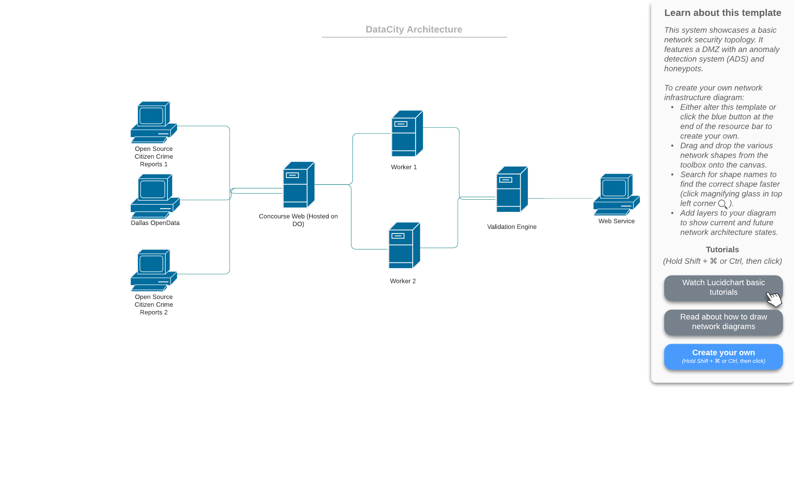

DataCity: A Validation Platform for Data
========================================

Welcome to Data City! Data City is an investigation/validation platform for different datasets pertaining between the
people and the government. Our motivation serves as a possible way to validate data "as it comes in" rather than after the
dataset is collected then published leading to messy data and mismatched records. 

DataCity was built for the CapsuleHack 2020 and below is our first implementation of DataCity and the methods involved. 
 
DISCLAIMER: THE FOLLOWING CODE IS ONLY TO BE USED FOR ACADEMIC PURPOSES. SCRAPING WEBSITES SUCH AS COMMUNITY CRIME MAP AND 
SPOTCRIME MAY BE IN VIOLATE OF USER POLICY. USE AT YOUR OWN LEGAL RISK.

System Architecture
===================

DataCity will need to have three components in order to make it a viable platform for continous analytics and for our 
`Proof of Concept` we will be focusing more towards Police Incident Data. 

- **1st Component**: A method of fetching the data and a large scalable platform to do so. DataCity will have an in-house 
                     concourse CI system that will have URLs to scrape from and collect/parse data. This system will be built
                     on digital ocean where the master node is the concourse web service that will serve as our interface
                     for running jobs for daily collection. The concourse CI will fetch data from three platforms: Community Map,
                     SpotCrime, and Dallas OpenData. Each request will be run on a 24 hour cycle when the Dallas Police Crime
                     Department updates their website with the appropiate Daily Crime Report.  
                     
- **2nd Component**: The second component will be the centralizer script that will perform the aggregation of the data.
                     The centralizer will be implementing fuzzy matching betweeen datasets if there is no key number reported
                     by the dataset. The output of this component will be a json file with key metrics about the datasets.

- **3rd Component**: The third component will be a webservice where you can observe as much in real time as we can get 
                     metrics about the different sets of data as it feeds into our validation engine. This will serve
                     as the interface as data is updated and notify followers of gaps in records.    
                     

System at it's current state:

  

**NOTE**: Workers are scalable for pulling more datasets

Validation Engine
=================

Proof of Concept: Category - Police Incident Data
=================================================

With the rise of open source reporting platforms like  `Open Data Network`, `Spot Crime`, `Community Map` it's
become easier for regular citizens to file police reports without having to go through the arduous police system. Folk
can also report crime in real time. 

This can also lead to conflicts with whatever is being recorded in the government databases.
So potentially we could receive a mismatch of records. 

We applied our idea on police incident data for several reasons

1. it was easy enough accessible data to gather from both open source citizen reporting and governemnt agencies
2. Police incident numbers have specific keys to query the incident which should be universal between different datasets.

What we Found?

Announcements
=============

- June 19th 2020 Intiailizing of the Repository.
- June 20th 2020 Project Submitted

Open Source Data Standards
==========================

Below is our standard needs for submitting validation to our engine. If you are a service that are reporting police 
incident data - we can measure your dataset against others and report metrics

[POLICE INCIDENT STANDARD](https://github.com/Sulstice/datacity/blob/master/places/cities/dallas/police/STANDARD.md) : DataCity provides a common data model for encapsulating information 

Genesis
=======

DataCity was designed for capsulehack.io and is the dream for three young developers who want to follow their path in centralizing all data. 

- Project Lead [Suliman sharif](http://sulstice.github.io/)
- Front-End Developer [Marvin Corro]()
- Devops [Chris Burke]()
- Graphics Designer [Elena Chow]()

* * * * *

External links
==============

- Houston Police Department Crime Statistics (https://www.houstontx.gov/police/cs/beatpages/beat_stats.htm)
- Austin Police Department Crime Statistics (https://data.austintexas.gov/Public-Safety/Crime-Reports/fdj4-gpfu/data)
- Dallas Police Department Crime Statistics (https://dallaspolice.net/resources/Pages/Crime-reports.aspx) 

