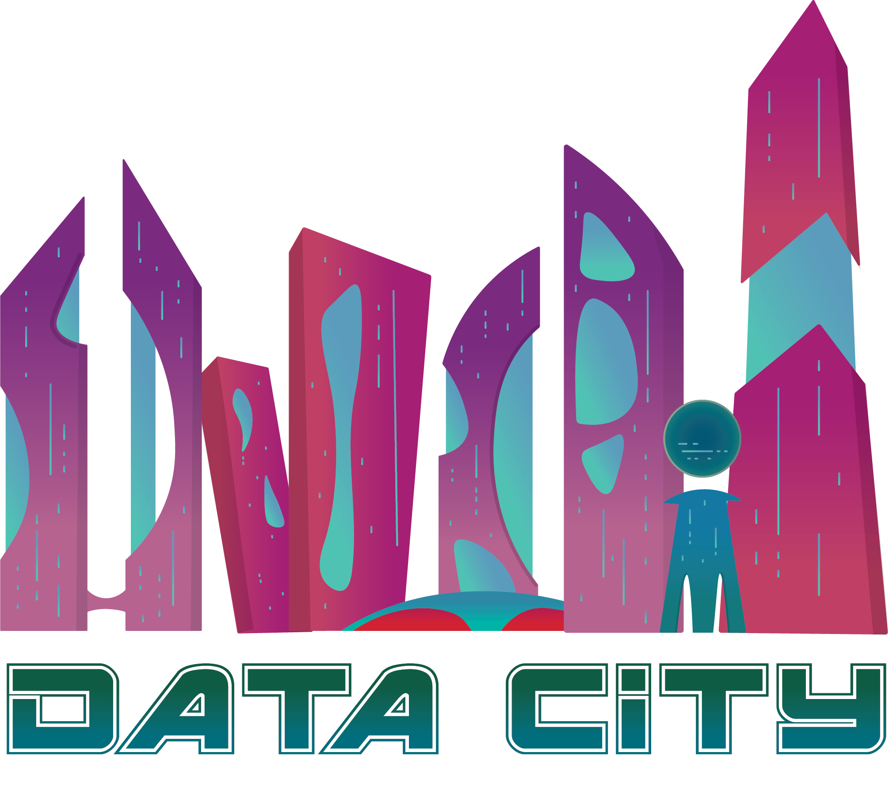
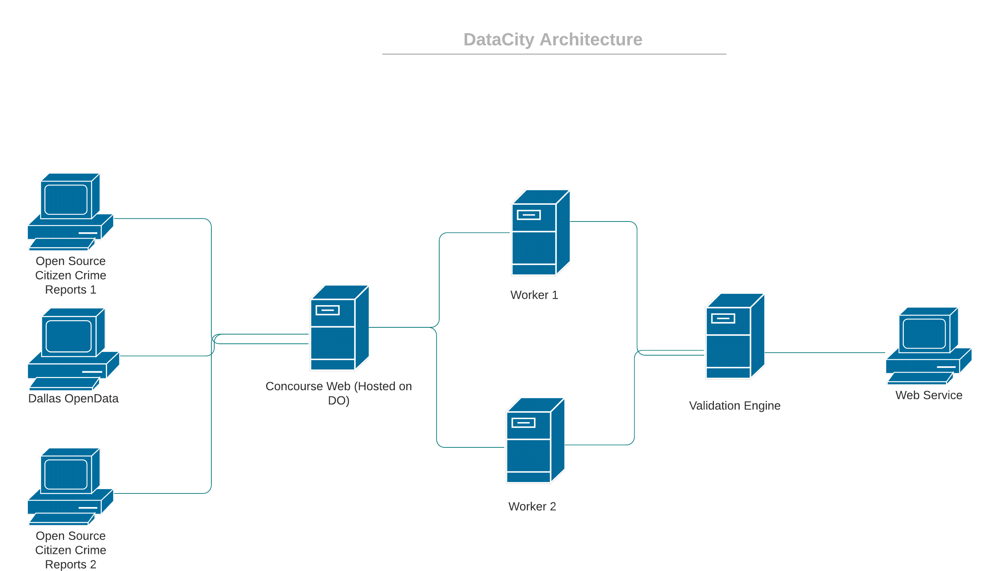
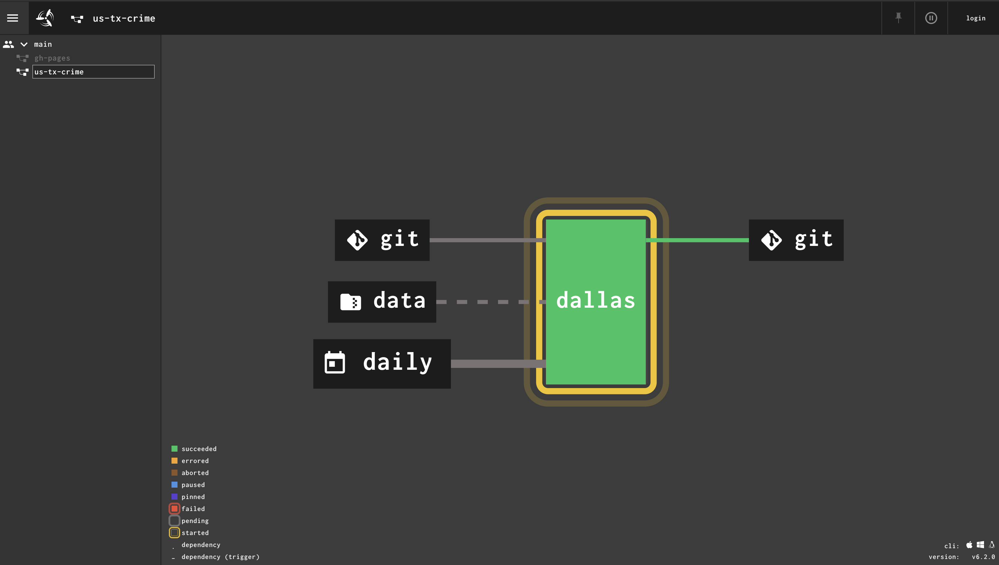
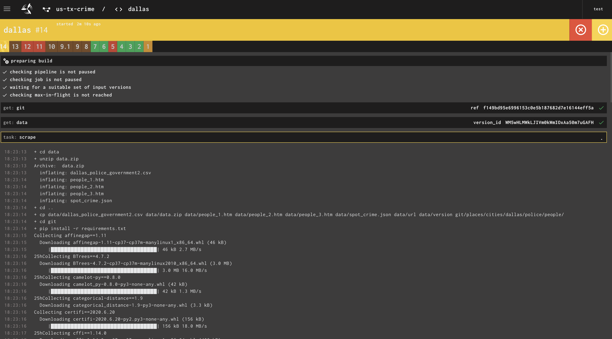
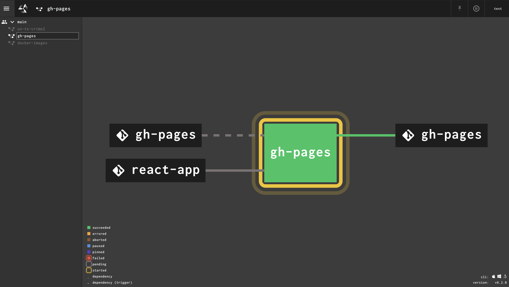
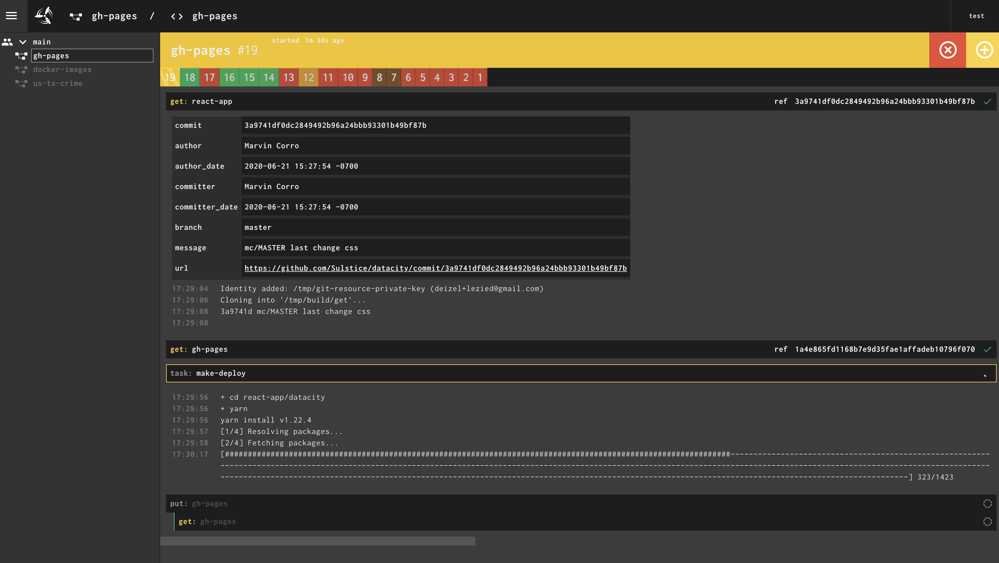
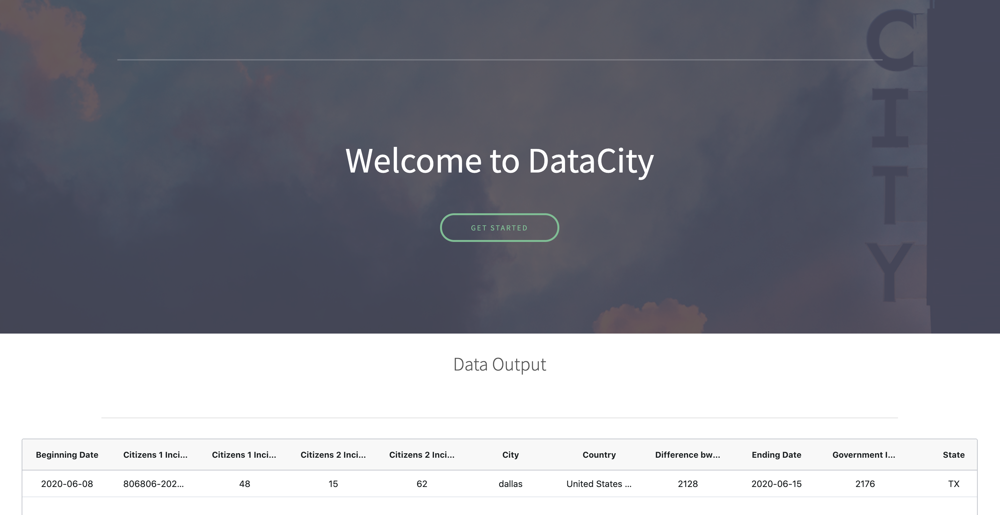
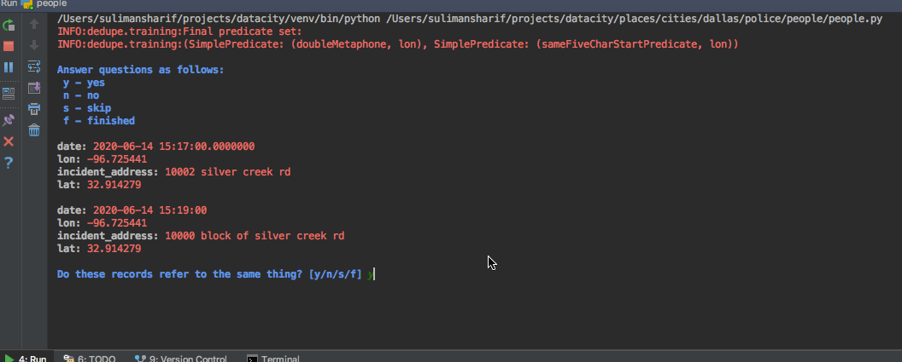

 DataCity: A Validation Platform for Data
========================================

[](https://opensource.org/licenses/MPL-2.0)

[](https://www.python.org/dev/peps/pep-0008/)
[](https://zenodo.org/badge/latestdoi/273564245)
[]()
[](http://shields.io/)
[]()

    <a href="https://github.com/badges/shields/pulse" alt="Activity">
        </a>
 []()

<p align="center">
  
</p>

Welcome to Data City! Data City is an investigation/validation platform for different datasets pertaining between different
platforms. Our motivation serves as a possible way to validate data "as it comes in" rather than after the
dataset is collected then published leading to messy data and mismatched records. Utilizing fuzzy matching or specific correlation
keys we can perform high confidence aggregation.

DataCity can serve as a validation and aggregation platform for all different types of data by centralizing it under an 
open source validation platform. People can submit suggestions to standards, validation code, and submit their own 
continous stream of data under one umbrella. 

DataCity was built for the CapsuleHack 2020 and below is our first implementation of DataCity and the methods involved. We are part of the 
"Cities" challenge. Clean efficient data that is unified and clear is what will drive cities to become "smart". We think this is the first step
into smart city innovation.

- Website: https://sulstice.github.io/datacity/
- Engine: (Ask for access)

System Architecture
===================

DataCity will need to have three components in order to make it a viable platform for continous analytics and for our 
`Proof of Concept` we will be focusing more towards Police Incident Data. 

- **1st Component**: A method of fetching the data and a large scalable platform to do so. DataCity will have an in-house 
                     concourse CI system that will have URLs to scrape from and collect/parse data. This system will be built
                     on digital ocean where the master node is the concourse web service that will serve as our interface
                     for running jobs for daily collection. The concourse CI will fetch data from three platforms: Community Map,
                     SpotCrime, and Dallas OpenData. Each request will be run on a 24 hour cycle when the Dallas Police Crime
                     Department updates their website with the appropiate Daily Crime Report.  
                     
- **2nd Component**: The second component will be the centralizer script that will perform the aggregation of the data.
                     The centralizer will be implementing fuzzy matching betweeen datasets if there is no key number reported
                     by the dataset. The output of this component will be a json file with key metrics about the datasets.

- **3rd Component**: The third component will be a webservice where you can observe as much in real time as we can get 
                     metrics about the different sets of data as it feeds into our validation engine. This will serve
                     as the interface as data is updated and notify followers of gaps in records.    
                     

System at it's current state:

<p align="center">
  
</p>

**NOTE**: Workers are scalable for pulling more datasets

Workers are running on digital ocean on a kubernetes cluster. Each node has 2 CPUs for processing data and running jobs 
for our data.

Engine
======

As datasets are being reported by various agencies and the people we record the data and aggregate values on a real-time basis.
Currently, our aggregation is set on a 24-hour cycle due to our POC. Depicted below is our Concourse CI Engine that manages
the continuous analytics.

<p align="center">
  
</p>

Here is an example of one of the workers running through the build process

<p align="center">
  
</p>

Our front-end website is built with ReactJS and a simple Ag-Grid table to display the data. The python mid layer updates
a JSON file and the app rebuilds using our engine. That's how we avoided a db setup but a potential avenue to build when 
we scale.

<p align="center">
  
</p>


Here is an example of one of the workers running through the build process

<p align="center">
  
</p>

Website generated at the end

<p align="center">
  
</p>

Validation
==========

Our validation and aggregation of data will be using `pandas` to parse datasets into dataframes and `fuzzy_pandas` to find 
commonalities between datasets and whether they are the same record.

Our main function parameters definitions for the Proof of Concept (POC) fuzzy matching were as follows:

```
left_on - columns of data we need to fuzzy match against for one subset
right_on - columns of data we need to fuzzy match against for the second subset
ignore_case - ignoring casing of words
method - string matching algorithm for best distance 
threshold - Our minimal entry for a viable candidate for a match
```

Proof of Concept: Category - Police Incident Data
=================================================

With the rise of open source reporting platforms it's become easier for regular citizens to file police reports 
without having to go through the arduous police system. Folk can also report crime in real time. 

This can also lead to conflicts with whatever is being recorded in the government databases.
So potentially we could receive a mismatch of records. 

We applied our idea on police incident data for several reasons

1. it was easy enough accessible data to gather from both open source citizen reporting and governemnt agencies
2. Police incident numbers have specific keys to query the incident which should be universal between different datasets.

Since we were in the essence of time we made it think that the data started coming in on the 9th of June to 16th of June 
to retrieve a viable dataset and why validation is necessary.

Continuous Analytic First Cycle Data Capture for police incidents in the state of Dallas

Fuzzy Matching at work:



**Citizen 1**

- Open Source Citizens 1 Platform: 48 Incidents were reported
- Government Incidents Reported: 2176 Incidents were reported 
- Missing Incidents from Citizens 1 Platform: 2128 were missing
- Missing Incidents from Government Platform: 0 were missing

**Citizen 2**
- Open Source Citizens 2 Incidents Scraped: 62 Incidents
- Government Missing Incidents at threshold 0.4: 15 Incidents were missing


The platform aggreggated data across three datasets and ran fuzzy matching comparing latitude, longitude, address, date, time, and
if it existed in the data set, incident number. 

Our fuzzy matching parameters are as follows:

- **threshold**: 0.40 - it was so low to allow for flexbility in mismatched records potentially. At a threshold of 0.01 we get a 100% match to government records
- **methods**: levenshtein - best known for string sub matching using distance. 


Our validation platform's first feature has been in analyzing police incident data to find missing records between three
different platforms. It is currently known that each platform is being utilized today in different districts but who are we 
to trust? DataCity hopes to show that.


Announcements
=============

- June 19th 2020 Intiailizing of the Repository.
- June 20th 2020 Project Submitted

Open Source Data Standards
==========================

Below is our standard needs for submitting validation to our engine. If you are a service that are reporting police 
incident data - we can measure your dataset against others and report metrics

[POLICE INCIDENT STANDARD](https://github.com/Sulstice/datacity/blob/master/places/cities/dallas/police/STANDARD.md) : DataCity provides a common data model for encapsulating information 

Genesis
=======

DataCity was designed for capsulehack.io and is the dream for three young developers who want to follow their path in centralizing all data. 

- Project Lead [Suliman sharif](http://sulstice.github.io/)
- Front-End Developer [Marvin Corro]()
- Devops [Chris Burke]()
- Graphics Designer [Elena Chow]()

* * * * *

External links
==============

- Houston Police Department Crime Statistics (https://www.houstontx.gov/police/cs/beatpages/beat_stats.htm)
- Austin Police Department Crime Statistics (https://data.austintexas.gov/Public-Safety/Crime-Reports/fdj4-gpfu/data)
- Dallas Police Department Crime Statistics (https://dallaspolice.net/resources/Pages/Crime-reports.aspx) 

**DISCLAIMER:** THE FOLLOWING CODE IS ONLY TO BE USED FOR ACADEMIC PURPOSES. PLEASE CHECK WITH THAT YOU HAVE ORIGINAL OWNERS PERMISSION TO USE THEIR DATA SET BEFORE USING OUR PROGRAM; USING DATASETS WITHOUT EXPRESSED CONSENT MIGHT BE VIOLATING 3RD PARTIES TERMS OF SERVICE. USE AT YOUR OWN LEGAL RISK.
